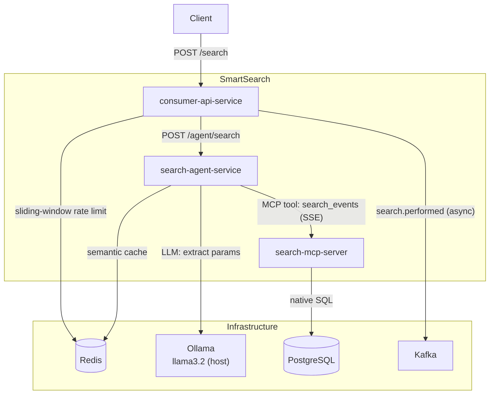
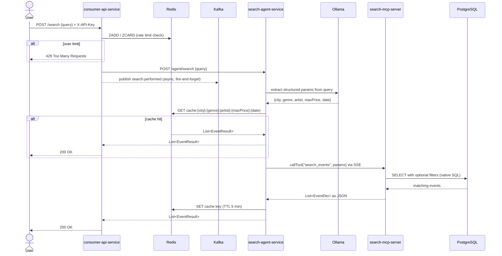

# SmartSearch
A demo microservices platform that lets users search for live events using natural language (e.g., "Jazz concerts in Berlin under €40 this weekend").

# How to run: 

- Start everything:

```bash
docker compose up --build
``` 

- Rebuild a single service after a code change

```bash
docker compose up --build consumer-api-service
``` 

- Only run the infrastructure

```bash
docker compose up postgres redis kafka
```

# Architecture

## Service Overview



## Request Sequence



